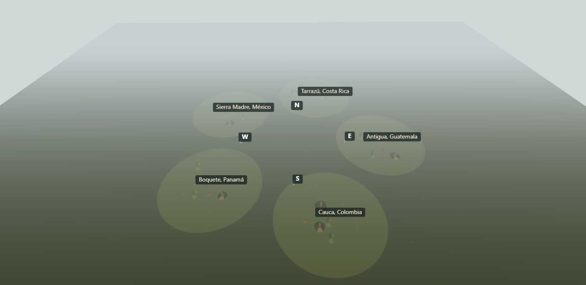
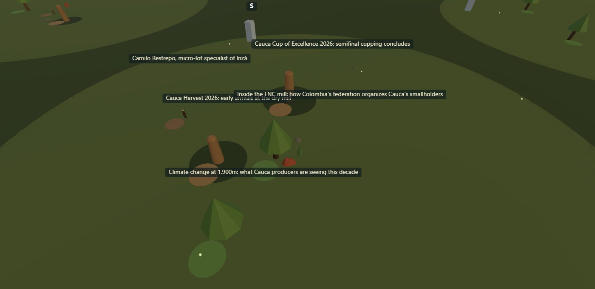
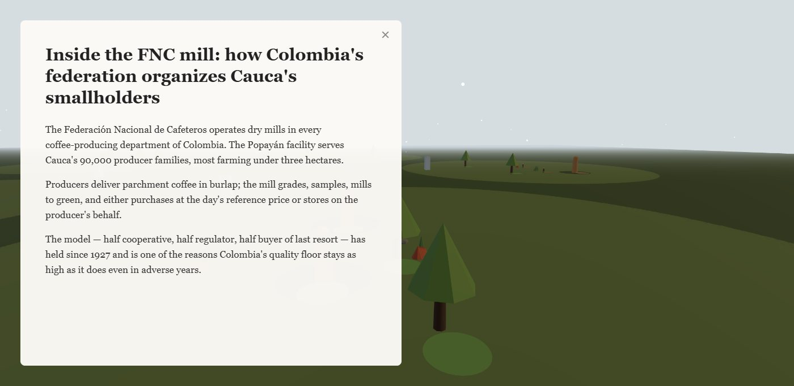
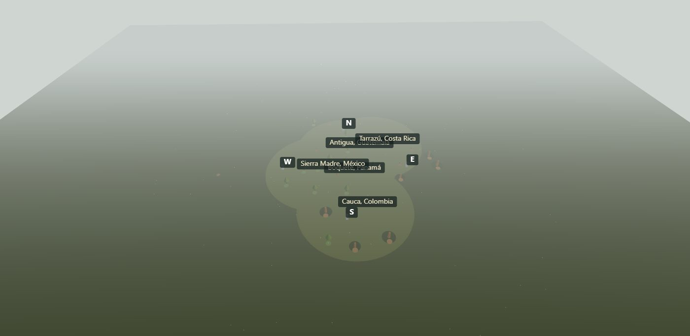

# Drupal three.js Theme — User & Technical Guide

*A Drupal 11 theme that renders a site's content as a navigable 3D world.
A URI is a coordinate; the document is read in situ.*

---

## Part I — Functional Usage

### 1. What this is

This is a Drupal theme, not a separate application. Drupal still owns
everything it normally owns — content, routing, authentication, menus,
access control. What changes is the *presentation*: instead of pages of
HTML, the site's content is rendered as a three-dimensional world that
the visitor flies through.

The governing idea: **a site is a place.** Every piece of content has a
position. Every URL is a coordinate that resolves to a vantage point in
that world. Reading an article means flying to where it lives and opening
it in place.

The corpus you see in these captures is a sample coffee publication —
articles, producer profiles, and dated events across five growing
regions (Antigua, Cauca, Boquete, Sierra Madre, Tarrazú).

### 2. First visit — the overview



Landing on `/` drops you at the **overview vantage**, looking down across
the whole world. Each clearing is a *sector* — here, a coffee-growing
region — labelled with its name. Floating posts mark the cardinal
directions (N/S/E/W) so you keep your bearing as you move.

Scattered across each clearing are the entities:

- **Trees** are articles. A taller tree is a longer article (height tracks
  word count).
- **Standing figures** are profiles — people. Height tracks how connected
  the person is in the corpus.
- **Totems on moss rings** are events — things that happen on a date.

The fog deepens with distance and the lighting shifts subtly per region
(a "biome" blend), so the world reads as a continuous place rather than a
flat diagram.

### 3. Navigating — flying into a region



Click a region label (or a clearing) and the camera flies down to the
**sector vantage**. At this altitude the world reveals more: every entity
in the *current* region sprays its title as a floating label. Entities in
*other* regions stay quiet — you only see the names of things you're close
enough to read.

Controls:

- **Drag** to orbit around the region.
- **Scroll / pinch** to zoom in and out.
- **Click** an entity to read it (see below).
- **Click empty ground** to step back out one level.
- **Hover** an entity (on desktop) to reveal a one-line summary under its
  title.
- **Keyboard**: `Esc` returns to overview; `Tab` / `Shift+Tab` cycle
  through entities; number keys `1`–`9` jump between regions.

### 4. Reading — the document in place



Click an entity and its full content opens in a reading panel anchored to
one side of the screen. The other half stays a **live, navigable world** —
the camera shifts sideways (a parallax move that keeps proportions
correct) so the entity you're reading sits in the open half. You can keep
dragging, zooming, and clicking other entities while you read; the panel
swaps its content as you move between them, with a brief loading shimmer
while the next document arrives.

On a phone the same idea rotates ninety degrees: the panel anchors to the
**top**, the world stays live in the **bottom** half.

Close the panel with the × button or `Esc`.

### 5. Two ways the world is organised

The same content can be laid out two different ways, and you can switch
between them.

**Taxonomy layout** (the default, shown above) places content by its
editorial tags — each region is a clearing, evenly spaced on a ring.
Geography reflects *how the content is filed*.



**Semantic layout** places content by *what it means*. Each document is
run through an embedding model; documents that talk about similar things
end up near each other in space, regardless of which region they're tagged
to. The five regions stop being neat circles and collapse into a single
organic cluster — because coffee articles across all regions share a lot
of vocabulary, so meaning pulls them together. Where the clusters *do*
separate, they separate by topic.

Switching is an operator action (see Part II, §12):

```
drush world:layout-mode semantic    # geography by meaning
drush world:layout-mode taxonomy    # geography by editorial tag
```

---

## Part II — Technical Implementation

### 6. Architecture — a two-side spine

The system has two halves that meet at a small, well-defined contract.

```
   DRUPAL (PHP)                          RENDERER (TypeScript / three.js)
   "the cypher"                          "the world"

   nodes ──▶ signature ──▶ descriptor    snapshot ──▶ SmartObjects ──▶ scene
                │              │             ▲            │
                ▼              ▼             │            ▼
        field_world_signature  gateway ─────┘        camera ⇄ URL
        (MariaDB: the truth)   (RESTHeart→Atlas)
```

- The **PHP side** ("the cypher") reads Drupal entities, extracts a
  *signature* (a compact, multi-axis description of each entity), builds a
  skinny *descriptor*, and serves a *snapshot* of the whole corpus as JSON.
- The **JS side** ("the renderer") fetches the snapshot, turns each
  descriptor into a *SmartObject* (a positioned group of meshes +
  interaction components), and runs the camera/navigation loop.

The only contract between them is a handful of HTTP endpoints (§13). The
renderer never touches the database; the cypher never knows about three.js.

### 7. The data pipeline

A node becomes a tree in five steps:

1. **Signature extraction.** On save (via a queue) the entity is read into
   `EntityFacts`, and `SignatureExtractor` computes a four-layer
   `Signature` — structural (word/paragraph/image counts), temporal
   (created/changed), relational (in/out degree), semantic (embedding
   slot). The signature is stored as JSON on `field_world_signature`.
   MariaDB owns the truth.
2. **Descriptor.** `DescriptorBuilder` projects the entity + signature into
   a *skinny descriptor* — the minimal shape the renderer needs (id, title,
   summary, type, sector, signature, card metadata).
3. **Gateway upsert.** The descriptor is pushed through a RESTHeart gateway
   into MongoDB Atlas. Drupal never holds a Mongo connection string.
4. **Snapshot.** `SnapshotPublisher` pulls all descriptors, lays out
   sectors, merges the palette, and emits one JSON document at
   `/world/snapshot/full`.
5. **Render.** `SceneManager` fetches the snapshot, dispatches each
   descriptor to a *Builder* matched on bundle, and adds the resulting
   SmartObject to the scene.

### 8. The signature model

Each entity carries a four-layer signature (`ARCHITECTURE.md §3`):

| Layer | Fields | Drives |
| --- | --- | --- |
| structural | wordCount, paragraphCount, imageCount | tree height, canopy density |
| temporal | createdAt, changedAt | (reserved: event urgency) |
| relational | inDegree, outDegree | profile height |
| semantic | embedding, modelVersion, embeddedAt | semantic layout (§11) |

Builders read whichever axes they care about. A forest article maps
`wordCount` to tree height on a log scale; a profile maps `inDegree` to
figure height. The mapping is the *atmosphere's* decision, kept in one
place per atmosphere.

### 9. SmartObjects and Builders

The renderer models every entity as a `SmartObject` — a `THREE.Group`
carrying an `entityId` and a list of *components*:

- `MeshComponent` — a primitive mesh (cylinder trunk, cone canopy).
- `GltfComponent` — a loaded `.glb` model (when a real asset is wired).
- `TriggerPadComponent` — the ground disc that drives the read interaction.
- `HtmlSurfaceComponent` — Drupal-rendered HTML painted as a 3D surface.

A `Builder` matches a bundle (`article`, `profile`, `event`) and assembles
the right components. Builders try a real asset first
(`ctx.tryLoadProp(slot)`) and fall back to atmosphere-coherent primitives —
a forest's fallback for an article is still tree-shaped, never a cube.

### 10. The asset pipeline

Real models are managed *as Drupal content*. Two content types:

- **pack** — an upstream asset pack (Quaternius, KayKit, …) with its
  license, attribution, and source.
- **asset** — one model bound to a *slot* (`oak-stylized`,
  `sapling-figure`, `standing-stone`, scenery), with a lifecycle status
  (`shortlisted → acquired → curated → live`) and a curated `.glb`.

`AssetSnapshotBuilder` emits every `live` asset into the snapshot's
`assets[]` block (also served standalone at `/world/snapshot/assets`).
On the client, `AssetCache` loads each `.glb` once via `GLTFLoader` and
hands out clones; `GltfComponent` attaches the clone scaled so its height
matches the signature-derived size. Mark an asset `live` in admin and the
matching primitives become real meshes on the next load — no code change.

### 11. Semantic layout — meaning becomes geography

The semantic layout (§5) closes the loop *content → embedding → position*:

1. **Embed.** `drush world:embed` gathers each entity's text and runs the
   whole corpus through an `EmbeddingProvider`. The default
   `LocalTfIdfEmbeddingProvider` is dependency-free and deterministic
   (TF-IDF + feature hashing to a fixed 256-dim vector); a
   `RemoteEmbeddingProvider` is the production neural seam (Voyage /
   OpenAI-compatible, one env var). Vectors are written into the
   signature's semantic layer.
2. **Project.** `drush world:relayout` reads the embeddings and runs
   `SemanticLayoutProjector` — classical multidimensional scaling (cosine
   distance → double-centred Gram matrix → top-2 eigenvectors via
   deterministic power iteration → 2D coordinates). MDS is chosen over
   UMAP/t-SNE because it's closed-form and deterministic, which the
   "URI is a coordinate" promise requires.
3. **Freeze.** The projected positions are frozen in state. The world only
   moves when an operator deliberately re-lays it out — so bookmarks stay
   valid as the corpus grows.
4. **Render.** `SnapshotPublisher` stamps each entity with its `worldPos`
   and derives *emergent* sector centroids (the mean of where a region's
   members landed). The renderer's `entityPosition()` reads `worldPos`
   first, falling back to the taxonomy layout when it's absent.

The result: sectors become *descriptive* (where a region's content landed
in meaning-space) rather than *prescriptive* (a slice content is forced
into).

### 12. Operator reference (drush)

| Command | Purpose |
| --- | --- |
| `drush world:publish` | Rebuild every descriptor and push to the gateway |
| `drush world:validate` | Health-check gateway, plugins, queue, snapshot |
| `drush world:embed` | Compute semantic embeddings for the whole corpus |
| `drush world:relayout` | Project embeddings to 2D, activate semantic layout |
| `drush world:layout-mode <taxonomy\|semantic>` | Switch layout without recomputing |
| `drush world:assets-status` | Print the live-asset matrix per atmosphere/slot |

### 13. HTTP endpoints

| Endpoint | Returns |
| --- | --- |
| `GET /world/health` | `{status, gateway, timestamp}` |
| `GET /world/snapshot/full` | Full corpus snapshot (world, sectors, entities, assets) |
| `GET /world/snapshot/assets` | Just the live-asset block (diagnostic) |
| `GET /world/descriptor/{id}` | One descriptor |
| `GET /world/card/{type}/{id}/{view_mode}` | Drupal-rendered HTML for the reading panel |
| `GET /sector/{termId}` | World shell at a sector vantage (deep-linkable) |

### 14. Completeness model

The project tracks its maturity in seven additive tiers
(`docs/MILESTONES.md`); each presupposes the ones before it:

- **MVP** — navigation + live content. *Reached (mobile pending verification).*
- **ALPHA 1** — world models from Drupal content types. *Pipeline shipped.*
- **ALPHA 2** — edit asset↔content relations in admin.
- **ALPHA 3** — edit world rules per "skin" in admin.
- **BETA 1** — multiple skins (forest, inner mind).
- **BETA 2** — large corpora via embedding-driven layout. *Pipeline shipped.*
- **RC1** — production: mobile, accessibility, performance, multi-tenant.

The full feature inventory follows in Appendix A.

---

## Appendix A — Feature Map

Every feature *considered* for the project, by domain, with status. This
is a snapshot; the living version is `docs/FEATURE_MAP.md`.

**Status:** ✅ shipped · ◐ partial · ○ planned · ⏸ deferred · ☾ beyond-1.0

### A. Spatial model & navigation

| Feature | Status |
| --- | --- |
| URI → coordinate mapping (`/`, `/sector/X`, `/node/Y`) | ✅ |
| Camera fly-to + settle-detection writing URL back | ✅ |
| Drag-orbit, pinch-zoom, wheel-zoom | ✅ |
| Idle drift; tab-visibility/focus pause | ✅ |
| Keyboard nav (Esc / Tab / number keys) | ✅ |
| `/tag/X`, `/search?q=` as coordinates | ○ |

### B. Content as world objects

| Feature | Status |
| --- | --- |
| Article→tree, Profile→spirit, Event→totem | ✅ |
| Fallback builder; per-entity silhouette variation | ✅ |
| Monuments (Mission / Vision / Contact) | ○ |
| TemporalUrgencyComponent (events glow toward their date) | ⏸ |

### C. Reading experience

| Feature | Status |
| --- | --- |
| FullView modal of live Drupal HTML | ✅ |
| Side modal + camera shift; live navigable other-half | ✅ |
| State machine + skeleton loader + content fade | ✅ |
| Parallel prefetch on far-click | ✅ |
| WorldHud labels → title spray → hover summary | ✅ |

### D. Asset pipeline (real `.glb`)

| Feature | Status |
| --- | --- |
| `pack` + `asset` content types | ✅ |
| `/world/snapshot/assets` + embedded `assets[]` | ✅ |
| `AssetCache` + `GltfComponent`; asset-first builders | ✅ |
| `drush world:assets-status` | ✅ |
| Scenery hookup; acquisition automation | ◐ |
| Admin "Mark live" UI (A.5) | ○ |

### E. Layout intelligence

| Feature | Status |
| --- | --- |
| Taxonomy layout + biome blending | ✅ |
| Semantic layout: embed → MDS → position | ✅ |
| Local TF-IDF + remote neural seam | ✅ |
| Frozen-in-state stability; `embed`/`relayout`/`layout-mode` | ✅ |
| Procrustes alignment; animated transitions | ○ |

### F. Editorial / admin control

| Feature | Status |
| --- | --- |
| Palette / atmosphere config-as-code | ✅ |
| Signature extraction pipeline (8-axis, queue) | ✅ |
| Admin asset↔content + slot bindings (ALPHA 2) | ○ |
| Skins-as-data in admin (ALPHA 3) | ○ |

### G. Atmospheres / skins

| Feature | Status |
| --- | --- |
| Forest atmosphere; lazy-import registry | ✅ |
| Second skin ("inner mind") (BETA 1) | ○ |
| Per-property atmosphere switching | ⏸ |

### H. Conversational layer

| Feature | Status |
| --- | --- |
| Chatvatar (LLM dialogue + speech UI + state machine) | ⏸ (v0.5) |
| LLM-augmented descriptors | ○ |

### I. Search & discovery

| Feature | Status |
| --- | --- |
| Query embedding → nearest-N → fly-through | ○ |
| Search UI (results as coordinates) | ○ |

### J. Platform / productization (RC1)

| Feature | Status |
| --- | --- |
| RESTHeart → Atlas gateway (single tenant) | ✅ |
| Multi-tenant proven across ≥2 properties | ○ |
| Theme install recipe (one-shot scaffold) | ○ |
| Production deploy of `dist/` verified through CI | ○ |
| Versioned snapshot API (v1→v2 migration) | ○ |
| Graceful failure (gateway/Atlas/.glb down) | ◐ |

### K. Quality bars (cross-cutting)

| Feature | Status |
| --- | --- |
| Desktop interaction | ✅ |
| Mobile touch parity | ◐ |
| Accessibility (ARIA, focus, SR fallback, reduced-motion) | ○ |
| Performance (bundle split, `.ktx2`, LOD budget) | ○ |
| Drupal admin coexistence | ○ |
| Test coverage on high-risk seams | ◐ |

### L. Backburner — beyond v1.0 ☾

- Socket-based multi-user (presence, shared navigation).
- Dynamic asset allocation for large worlds (frustum/distance spawn).
- Level of detail (LOD chains, imposters, crossfade).
- A generic "game engine core" extracted from the Drupal binding.

**Bottom line:** the engine and its two hardest ideas —
document-in-situ navigation and meaning-as-geography — are load-bearing
and demoable. Between here and 1.0: editorial self-service (ALPHA 2/3),
a second skin (BETA 1), the productization quality bars (RC1), and
chatvatar as the one big deferred capability.

---

*Generated from the `drupal-three-js-theme` project. See `docs/ARCHITECTURE.md`,
`docs/MILESTONES.md`, `docs/FEATURE_MAP.md`, and `docs/BATTLE_SCARS.md` for the
deep reference.*
